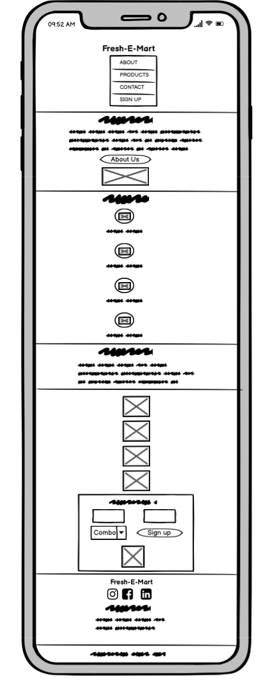
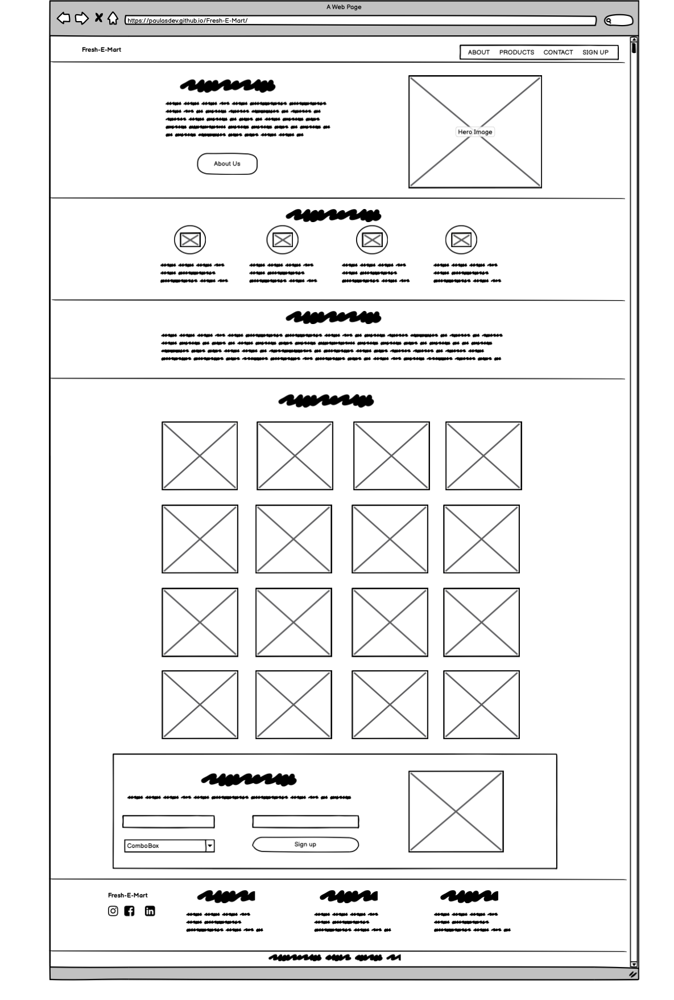
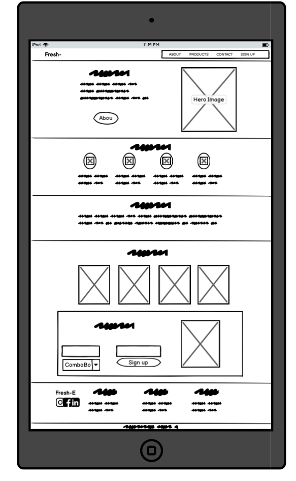
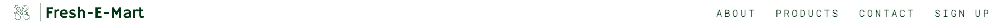
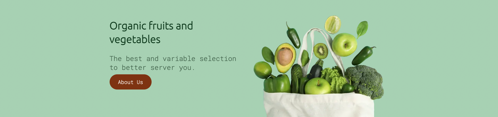
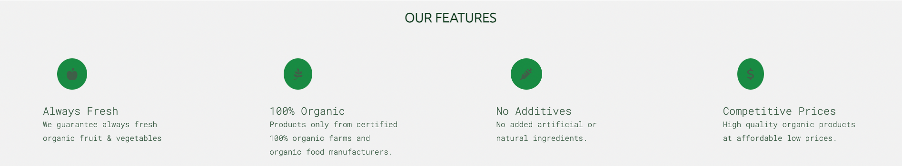
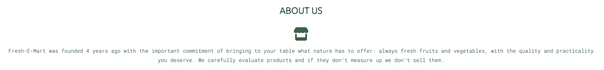
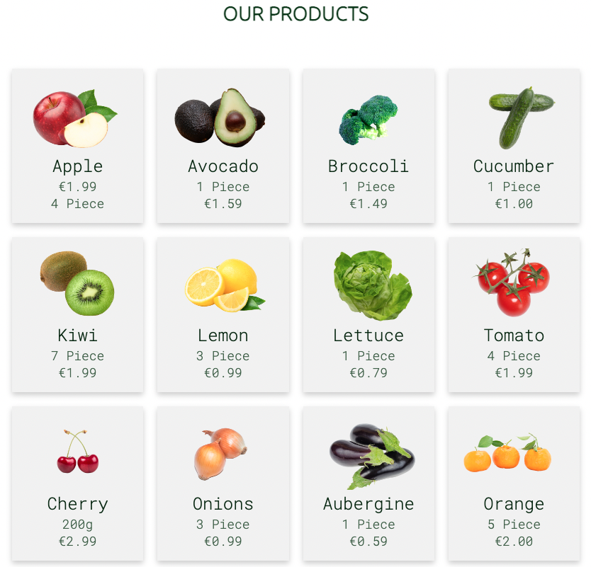
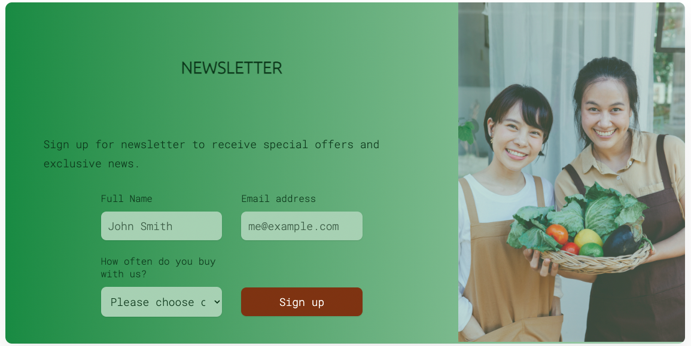
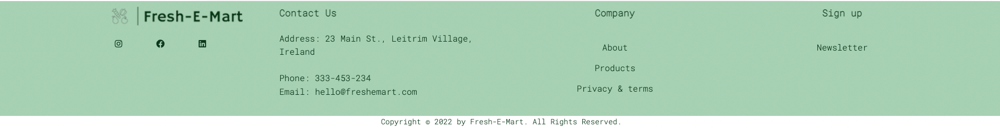

# **Fresh Mart**

Fresh-E-Mart is a small shop that sells the best and most varied selection of fruits and organics to better serve our consumers.
This website aims to keep our customers informed about the best prices and qualities of fruits and vegetables.

## Live Site
[Fresh-E-Mart](https://paulasdev.github.io/Fresh-E-Mart/)

## Repository 
[https://github.com/paulasdev/Fresh-E-Mar](https://github.com/paulasdev/Fresh-E-Mart)

- - -

## **Table of Contents**

1. [UX Development](#ux-development)
    * [Project Goal](#project-goal)

    * [User Stories](#user-stories)
        * [New User](#new-user)
        * [Returning Users](#returning-users)
        * [Admin User](#admin-user)
        * [Target Audience](#target-audience)

    * [Design](#design)
        * [Colour Scheme](#colour-scheme)
        * [Typography](#typography)
        * [Imagery](#imagery)
        * [Site Structure](#site-structure)
        * [Wireframes](#wireframes)
      
2. [Features](#features)  
    * [Existing Features](#existing-features)
        * [Navigation Bar](#navigation-bar)
        * [Header](#header)
        * [Features Section](#features-section)
        * [About Section](#about-section)
        * [Product Section](#collection-section)
        * [Newsletter Section](#contact-section)
        * [Footer](#footer)
        
3. [Technology Used](#technology-used)  
    * [Language Used](#language-used)
    * [Tools and Libraries](#tools-and-libraries)

4. [Testing](#testing)

5. [Deployment](#deployment)  
  
6. [Credits](#credits)  
    * [Content](#content)
    * [Media](#media)  

- - -

# **Table of Contents**

## UX Development
 ### Project Goal
Demonstrate my competence using HTML and CSS languages in building a responsive website.

The website should promote the small fruit and vegetable shop to the local community

## User Stories
### New User
* I want to easily navigate the site and find the relevant information easily.
* I want to know more about the fruits and vegetables available and prices.
* I want to subscribe to receive updates.
* I want to know the address and contact number
* I want to interact with social media

### Returning Users
* I want to know about the offers of the week
* I want to be able to contact the company with any further questions.
* I want to be able to subscribe to receive updates.

### Admin User
* Update your product list with ease
* Receive the correct information from subscribers
* Send correct information to users.

### Target Audience
* Fruit and vegetable consumers.
       
## Design
### Colour Scheme

The colour scheme was inspired by the hero image, with different shades of green and a brown tone for the CTA.

The colour palette was created using the [Coolors](https://coolors.co/7b3307-113719-2b8a3e-415f47-aad0b2) to generate some colour codes as inspiration for the site.

### Typography

Google Fonts was used for the following fonts:

Ubuntu is used for headings on the site. It is a serif font.
Roboto Mono is used for the body text on the site. It is a monospace font.

### Imagery
The photos featured throughout the site were obtained from free image providers such as Vecteezy, Pexels, Pixibay.

### Site Structure

Fresh-E-Mart is a 4 sections and 2 pages website. The home page is the default loading page. the other sections are accessible from the navigation menu at all times.  

### Wireframes

The Wireframes were produced using [Balsamiq](https://balsamiq.com/). 
The final site varies from the wireframes due to developments that occurred during the building process. 

#### Phone

#### Desktop

#### Tablet

## Features

### Navigation Bar

- The navigation bar is responsive and fixed at the top of the page where it shows the logo and name on the right.
- The navigation links on the right take the user to different sections on the same page.

### Header
- The header provides information about what the site is on the left side with a brown button to draw the user's attention to click and learn more about the business.
- On the right side we have the hero image that based on it we choose the color palette to bring an attractive designer to users

### Features Section
- The products section in four columns that show details of our features and identity that is to users.

### About Section
- The section about shows when our small business started and our main goal with users.

### Product Section
- There are four columns and four lines in the products section that present information about the products we offer with image, product name and price.
- This section is updated weekly to better serve our users.

### Newsletter Section
- The newsletter section has a form to collect details from customers who want to know about our product updates.
- The form collects the user's name, email and 3 options of how often the user buy with us.

### Footer
- The footer has 4 columns with contact information.
- In the first column are the company logo that leads to the top of the page and 3 social media links.
- The second column the user identifies our address, telephone number and contact email.
- The next two columns to the right of the footer are links to sections of the entire page

   

### Languages Used

- HTML and CSS were used to create this website.

### Frameworks, Libraries & Programs Used

- [Balsamiq](https://balsamiq.com/) - for wireframes
- [Procreate](https://procreate.art/) - for manipulating images
- [coolors.co](https://coolors.co/d3ab9e-eac9c1-ebd8d0-fffbff-fefeff) - the colour scheme was inspired by colours generated here 
- [Font Awesome](https://fontawesome.com/) - multiple icons implemented throughout the site from font awesome version 5
- [Google Fonts](https://fonts.google.com/) - Both fonts used in the website imported from here 
- [Chrome Dev Tools](https://developer.chrome.com/docs/devtools/) - used extensively to experiment with grid, flexbox and general responsiveness. 
- [Gitpod](https://www.gitpod.io/) - used to used to create and host the website
- [Github](https://github.com/) - used to deploy the website 
- [Am I responsive](https://ui.dev/amiresponsive) - to create an image displaying the home page on various devices 
- [Logo creator](https://logo.e.jimdo.com/) - to create logo

### Deployment 

The site was deployed to GitHub pages. 

### Deploy to GitHub Pages

1. Navigate to the settings tab in the GitHub repository 
2. Once in settings, navigate to the pages tab on the left of the page 
3. Under source, select branch ‘master’ and then click ‘save’
4. page will no automatically refresh and show a detailed ribbon display to indicate deployment 

### To Fork the Repository 

To make a copy or ‘fork’ the repository - 

1. Log into GitHub and locate repository 
2. On the right hand side of the page select the ‘fork’ option to create and copy of the original

### To create a Local Clone 

1. under the repository name, click on the ‘code’ tab 
2. in the clone box, HTTPS tab, click on the clipboard icon 
3. in your IED open GitBash 
4. Changed the current working directory to the location you want the cloned directory to be made
5. Type ‘git clone’ and then paste the URL copied from GitHub
6. press enter and the local clone will be created 

### Testing

[Testing.md](TESTING.md) 

### Credits 
I would like to thank my mentor Simen Daehlin for his guidance, help, patience and advice.

### Media
Product and Hero images are from the free website [Vecteezy](https://www.vecteezy.com/).

