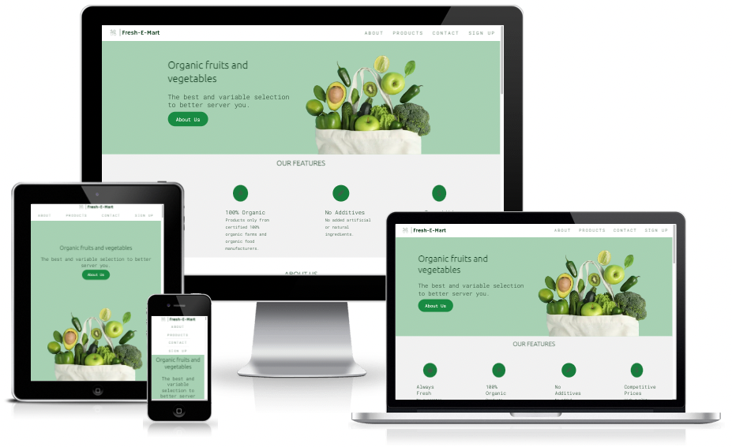
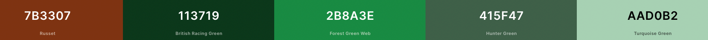
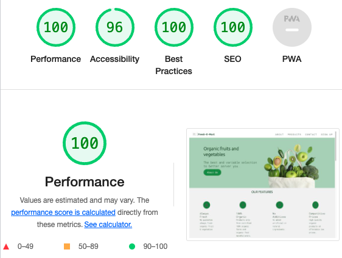

# **Fresh Mart**

Fresh-E-Mart is a website for a small business selling the best and variable selection of organic fruits and vegetables to better serve our consumers.

[View deployed site](https://paulasdev.github.io/Fresh-E-Mart/)

- - -

## **Table of Contents**

1. [UX Development](#ux-development)
    * [PROJECT GOAL](#project-goal)

    * [USER STORIES](#user-stories)
        * [New User](#new-user)
        * [Returning Users](#returning-users)
        * [Admin User](#admin-user)
        * [Target Audience](#target-audience)

    * [DESIGN](#design)
        * [Colour Scheme](#colour-scheme)
        * [Typography](#typography)
        * [Imagery](#imagery)
        * [Wireframes](#wireframes)
      
2. [Features](#features)  
    * [EXISTING FEATURES](#existing-features)
        * [Navigation Bar](#navigation-bar)
        * [Landing Page](#landing-page)
        * [About Section](#about-section)
        * [Collection Section](#collection-section)
        * [Contact Section](#contact-section)
        * [Footer](#footer)
        
3. [Technology Used](#technology-used)  
    * [Language Used](#language-used)
    * [Tools and Libraries](#tools-and-libraries)

4. [Testing](#testing)
    * [Unfixed Bugs](#unfixed-bugs)

5. [Deployment](#deployment)  
  
6. [Credits](#credits)  
    * [Content](#content)
    * [Media](#media)  

- - -

# **UX Development**
Fresh-E-Mart website keeps our customers informed about the best prices and qualities of fruits and vegetables.
Intended for those people who want to consume fresh and organic vegetables with quality and great prices all year round.

## **USER STORIES**

### **New User**
* I want to easily navigate the site and find the relevant information easily.
* I want to know more about the fruits and vegetables available and prices.
* I want to subscribe to receive updates.
* I want to know the address and contact number
* I want to interact with social media

### **Returning Users**
* I want to know about the offers of the week
* I want to be able to contact the company with any further questions.
* I want to be able to subscribe to receive updates.

### **Admin User**
* Update your product list with ease
* Receive the correct information from subscribers
* Send correct information to users.

 
       
# **DESIGN**
**Colour Scheme**

The colour palette was created using the [Coolors](https://coolors.co/7b3307-113719-2b8a3e-415f47-aad0b2) website.

**Typography**

Google Fonts was used for the following fonts:

Ubuntu is used for headings on the site. It is a serif font.
Roboto Mono is used for the body text on the site. It is a monospace font.

**Imagery**
The photos featured throughout the site were obtained from free image providers such as Vecteezy, Pexels, Pixibay.

### Languages Used

HTML and CSS were used to create this website.

### Frameworks, Libraries & Programs Used

Balsamiq - Used to create wireframes.

Git - For version control.

Github - To save and store the files for the website.

Google Fonts - To import the fonts used on the website.

Font Awesome - For the iconography on the website.

Google Dev Tools - To troubleshoot and test features, solve issues with responsiveness and styling.

### Deployment & Local Development

# **TESTING**

## *HTML
    ** No errors returned when passing through the official W3C validator
## *CSS
    ** No errors were found when passing trough the official(Jigsaw) validator

## *Accessibility
  
 I confirmed that the colors and fonts chosen are easy to read and acessible by running it through lighthouse in devtools
   

## **Imagery**

## **Wireframes**
      logo creator: https://logo.e.jimdo.com/
      color: https://maketintsandshades.com/