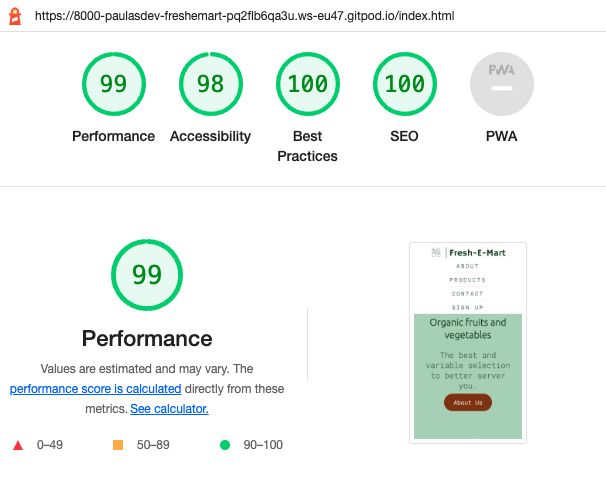

# **Fresh Mart**

Fresh-E-Mart is a small shop that sells the best and most varied selection of fruits and organics to better serve our consumers.
This website aims to keep our customers informed about the best prices and qualities of fruits and vegetables.

## Live Site
[Fresh-E-Mart](https://paulasdev.github.io/Fresh-E-Mart/)

## Repository 
[https://github.com/paulasdev/Fresh-E-Mar](https://github.com/paulasdev/Fresh-E-Mart)

- - -

## **Table of Contents**

1. [UX Development](#ux-development)
    * [PROJECT GOAL](#project-goal)

    * [USER STORIES](#user-stories)
        * [New User](#new-user)
        * [Returning Users](#returning-users)
        * [Admin User](#admin-user)
        * [Target Audience](#target-audience)

    * [DESIGN](#design)
        * [Colour Scheme](#colour-scheme)
        * [Typography](#typography)
        * [Imagery](#imagery)
        * [Wireframes](#wireframes)
      
2. [Features](#features)  
    * [EXISTING FEATURES](#existing-features)
        * [Navigation Bar](#navigation-bar)
        * [Landing Page](#landing-page)
        * [About Section](#about-section)
        * [Collection Section](#collection-section)
        * [Contact Section](#contact-section)
        * [Footer](#footer)
        
3. [Technology Used](#technology-used)  
    * [Language Used](#language-used)
    * [Tools and Libraries](#tools-and-libraries)

4. [Testing](#testing)
    * [Unfixed Bugs](#unfixed-bugs)

5. [Deployment](#deployment)  
  
6. [Credits](#credits)  
    * [Content](#content)
    * [Media](#media)  

- - -

# **Table of Contents**

## **UX Development**
 ### **Project Goal**
Demonstrate my competence using HTML and CSS languages in building a responsive website.

The website should promote the small fruit and vegetable shop to the local community

## **User Stories**

### **New User**
* I want to easily navigate the site and find the relevant information easily.
* I want to know more about the fruits and vegetables available and prices.
* I want to subscribe to receive updates.
* I want to know the address and contact number
* I want to interact with social media

### **Returning Users**
* I want to know about the offers of the week
* I want to be able to contact the company with any further questions.
* I want to be able to subscribe to receive updates.

### **Admin User**
* Update your product list with ease
* Receive the correct information from subscribers
* Send correct information to users.

## **Target Audience
* Fruit and vegetable consumers.
       
# **DESIGN**
**Colour Scheme**

The colour scheme was inspired by the hero image, with different shades of green and a brown tone for the CTA.

The colour palette was created using the [Coolors](https://coolors.co/7b3307-113719-2b8a3e-415f47-aad0b2) to generate some colour codes as inspiration for the site.

**Site Structure**

Fresh-E-Mart is a 4 sections and 2 pages website. The home page is the default loading page. the other sections are accessible from the navigation menu at all times.  

**Wireframes**

The Wireframes were produced using [Balsamiq](https://balsamiq.com/). 
The final site varies from the wireframes due to developments that occurred during the building process. 

**Typography**

Google Fonts was used for the following fonts:

Ubuntu is used for headings on the site. It is a serif font.
Roboto Mono is used for the body text on the site. It is a monospace font.

**Imagery**
The photos featured throughout the site were obtained from free image providers such as Vecteezy, Pexels, Pixibay.

### Languages Used

- HTML and CSS were used to create this website.

### Frameworks, Libraries & Programs Used

- [Balsamiq](https://balsamiq.com/) - for wireframes
- [Procreate](https://procreate.art/) - for manipulating images
- [coolors.co](https://coolors.co/d3ab9e-eac9c1-ebd8d0-fffbff-fefeff) - the colour scheme was inspired by colours generated here 
- [Font Awesome](https://fontawesome.com/) - multiple icons implemented throughout the site from font awesome version 5
- [Google Fonts](https://fonts.google.com/) - Both fonts used in the website imported from here 
- [Chrome Dev Tools](https://developer.chrome.com/docs/devtools/) - used extensively to experiment with grid, flexbox and general responsiveness. 
- [Gitpod](https://www.gitpod.io/) - used to used to create and host the website
- [Github](https://github.com/) - used to deploy the website 
- [Am I responsive](https://ui.dev/amiresponsive) - to create an image displaying the home page on various devices 

### Deployment & Local Development

# **TESTING**

Please refer [**_here_**](TESTING.md) for more information on testing of the Fresh-E-Mart website. 

## *Accessibility
  
 I confirmed that the colors and fonts chosen are easy to read and acessible by running it through lighthouse in devtools
   

## **Imagery**

## **Wireframes**
      logo creator: https://logo.e.jimdo.com/
      color: https://maketintsandshades.com/