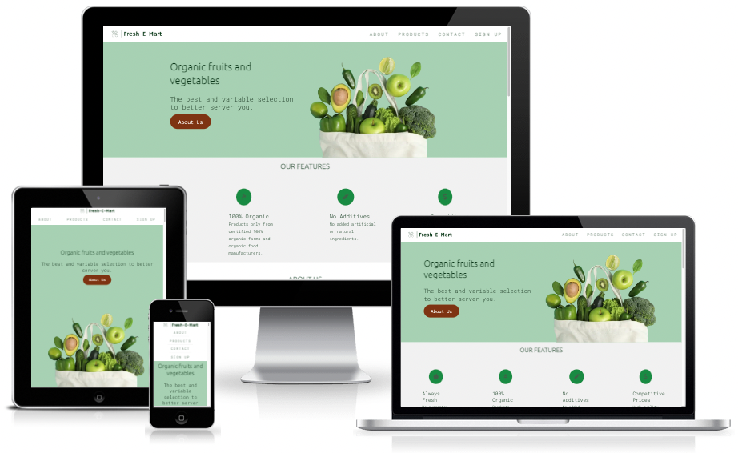

# **Fresh Mart**
## **PROJECT GOAL**

Fresh-E-Mart is a website with the best and variable selection of organic fruits and vegetables to better serve our consumers.

Intended for those people who want to consume fresh and organic vegetables with quality and great prices all year round.

Just choose your products, and we will contact you to deliver them in the comfort of your home.

[View deployed site](https://paulasdev.github.io/Fresh-E-Mart/)

- - -

## **Table of Contents**

1. [UX Development](#ux-development)
    * [PROJECT GOAL](#project-goal)

    * [USER STORIES](#user-stories)
        * [New User](#new-user)
        * [Returning Users](#returning-users)
        * [Admin User](#admin-user)
        * [Target Audience](#target-audience)

    * [DESIGN](#design)
        * [Colour Scheme](#colour-scheme)
        * [Typography](#typography)
        * [Imagery](#imagery)
        * [Wireframes](#wireframes)
      
2. [Features](#features)  
    * [EXISTING FEATURES](#existing-features)
        * [Navigation Bar](#navigation-bar)
        * [Landing Page](#landing-page)
        * [About Section](#about-section)
        * [Collection Section](#collection-section)
        * [Contact Section](#contact-section)
        * [Footer](#footer)
        
3. [Technology Used](#technology-used)  
    * [Language Used](#language-used)
    * [Tools and Libraries](#tools-and-libraries)

4. [Testing](#testing)
    * [Unfixed Bugs](#unfixed-bugs)

5. [Deployment](#deployment)  
  
6. [Credits](#credits)  
    * [Content](#content)
    * [Media](#media)  

- - -

# **UX Development**

## **USER STORIES**

### **New User**
* I want to easily navigate the site and find the relevant information easily.
* I want to know more about the fruits and vegetables available and prices.
* I want to subscribe to receive updates.
* I want to know the address and contact number
* I want to interact with social media

### **Returning Users**
* I want to know about the offers of the week
* I want to be able to contact the company with any further questions.
* I want to be able to subscribe to receive updates.

### **Admin User**
* Update your product list with ease
* Receive the correct information from subscribers
* Send correct information to users.

 
       
### **Target Audience**
* 

# **DESIGN**
## **Colour Scheme**

## **Typography**

## **Imagery**

## **Wireframes**
      logo creator: https://logo.e.jimdo.com/
      color: https://maketintsandshades.com/