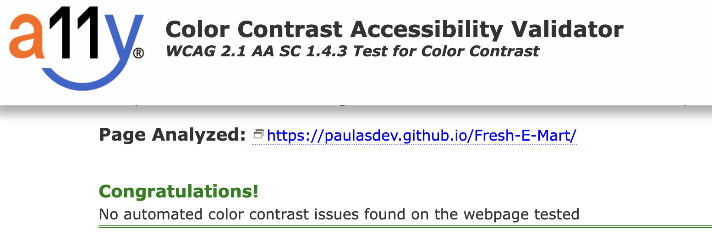

# Testing 

The Fresh-E-Mart site has been tested in the following ways -

- [Code Validation](#code-validation)
    - [W3C HTML Validator](#w3c-html-validator) 
    - [W3C CSS Validator](#w3c-css-validator)
- [Lighthouse](#lighthouse)
- [Responsiveness](#responsiveness)
- [A11y Color Contrast Accessibility Checker](#a11y-color-contrast-accessibility-checker)
- [Browser Compatibility](#browser-compatibility)
- [Testing User Stories](#testing-user-stories)
- [Peer Review](#peer-review)
- [Bugs](#bugs)
    - [Resolved](#resolved)
    - [Unresolved](#unresolved)

## Code Validation 

### W3C HTML Validator

Index Page

Thank-You Page

### W3C CSS Validator 

All pages passed the CSS validator without error. 

## Lighthouse 

I Used Lighthouse in Chrome Developer Tools to test each of the pages for:

- Performance - How the page performs whilst loading.
- Accessibility - How accessible is the site for all users and how can it be improved.
- Best Practices - How does the site conform to industry best practices.
- SEO - Search engine optimisation. Is the site optimised for search engine result rankings.

- As an example, the results for the Fresh-E-Mart website for both Mobile.

## Responsiveness 

Responsive design tests were carried out manually using [Google Chrome DevTools](https://developer.chrome.com/docs/devtools/). 

This included:
- Iphone SE, XR, 12pro
- Pixel 5
- Samsung Galaxy S8, S20 Ultra, A51/71
- Ipad Air & Mini
- Surface pro 7 & duo
- Galaxy Fold
- Nest Hub & Hub Max

## A11y Color Contrast Accessibility Checker

Colour contrast tests were carried out across the website and all came back without issue. 

## Browser Compatibility

The site was tested on Google Chrome, Microsoft Edge, Safari and Mozilla Firefox, with no visible issues for the user. Appearance, functionality and responsiveness were consistent throughout for a range of device sizes and browsers.

## Bugs

Back to the [README.md](./README.md#testing)